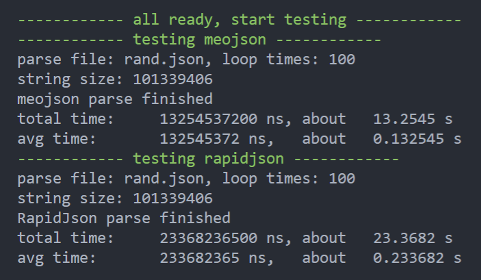

# meojson

[English](#CPP_JSON_Parser_Generator)

## C++ JSON解析/生成库

### 简介

- `meojson`是一个`非常快`的C++ JSON解析库，O(n)级复杂度，解析巨型JSON的速度比腾讯RapidJson快70%以上！

    ```bash
    # 测试方法
    sh test/parse/performance_test.sh
    ```

    

- `meojson`也是一个使用方便的C++ JSON生成库，可以使用各种语法糖优雅地生成JSON

    ```c++
    json::value json;
    json["hello"] = "meojson";
    json["Pi"] = 3.1416;

    json["arr"] = json::array(
        {"a", "b", "c"}
    );

    json["obj"] = json::object(
        {
            {"obj_key1", "aaa"},
            {"obj_key2", 123},
            {"obj_key3", true}
        }
    );
    json["obj_another"]["child"]["grand"] = "i am grand";

    // Output "{"obj_another":{"child":{"grand":"i am grand"}},"obj":{"obj_key3":true,"obj_key2":123,"obj_key1":"aaa"},"arr":["a","b","c"],"Pi":3.141600,"hello":"meojson"}"
    std::cout << json.to_string() << std::endl;
    ```

- `meojson`完全符合JSON标准

    ```bash
    # 测试方法
    sh test/parse/conformance_test.sh
    ```

    测试数据来自 <https://github.com/miloyip/nativejson-benchmark>

    
    
    其中`fail18.json`并不是一个错误的JSON，可以参考 <https://stackoverflow.com/questions/42116718/is-there-an-array-depth-limitation-in-json>。当然如果出现未发现的解析错误，也欢迎向我提ISSUE

- `meojson`仅依赖于STL，但需要编译器支持C++17标准

### 使用

1. 构建生成静态库

    ```bash
    make
    ```

2. 将`build/libmeojson.a`添加到您的项目中
3. 在您的代码中添加头文件包含

    ```c++
    #include "json.h"
    ```

4. 尽情使用吧！

### 示例

```c++
/***
 * from sample/sample.cpp
***/

#include <iostream>

#include "json.h"

int main()
{

    /*** Parse ***/
    {
        std::cout << "****** Parsing ****** " << std::endl;
        std::string content = R"(
        {
            "prject": {
                "name": "meojson",
                "list": [
                    1, 2, 3
                ]
            }
        }
        )";
        //std::cout << content << std::endl;

        auto ret = json::parser::parse(content);

        if (ret)
        {
            auto value = ret.value();  // As also, you can use rvalues, like `auto value = std::move(ret).value();`
            // Output "meojson"
            std::cout << value["prject"]["name"].as_string() << std::endl;
            // Output 2
            std::cout << value["prject"]["list"][1].as_integer() << std::endl;
        }
        else
        {
            std::cout << "parse failed" << std::endl;
        }
    }

    std::cout << std::endl;

    /*** Generate ***/
    {
        std::cout << "****** Generating ******" << std::endl;

        json::value json;
        json["hello"] = "meojson";
        json["Pi"] = 3.1416;

        json["arr"] = json::array(
            {"a", "b", "c"});
        json["obj"] = json::object(
            {{"obj_key1", "aaa"},
             {"obj_key2", 123},
             {"obj_key3", true}});
        json["obj_another"]["child"]["grand"] = "i am grand";

        // Output "{"obj_another":{"child":{"grand":"i am grand"}},"obj":{"obj_key3":true,"obj_key2":123,"obj_key1":"aaa"},"arr":["a","b","c"],"Pi":3.141600,"hello":"meojson"}"
        std::cout << json.to_string() << std::endl;
    }

    std::cout << std::endl;

    return 0;
}
```

## CPP_JSON_Parser_Generator

### Introduction

- `meojson` is a `very fast` json parser for C++, O(n) Complexity, pasing huge json will be 70% faster than Tecent's RapidJson.

    ```bash
    # How to test
    sh test/parse/performance_test.sh
    ```

    

- `meojson` is also an easy-to-use json generator for C++ that can use various syntactic sugars to elegantly generate JSON

    ```c++
    json::value json;
    json["hello"] = "meojson";
    json["Pi"] = 3.1416;

    json["arr"] = json::array(
        {"a", "b", "c"}
    );

    json["obj"] = json::object(
        {
            {"obj_key1", "aaa"},
            {"obj_key2", 123},
            {"obj_key3", true}
        }
    );
    json["obj_another"]["child"]["grand"] = "i am grand";

    // Output "{"obj_another":{"child":{"grand":"i am grand"}},"obj":{"obj_key3":true,"obj_key2":123,"obj_key1":"aaa"},"arr":["a","b","c"],"Pi":3.141600,"hello":"meojson"}"
    std::cout << json.to_string() << std::endl;
    ```

- `meojson` is fully compliant with the JSON standard

    ```bash
    # How to test
    sh test/parse/conformance_test.sh
    ```

    Test data from <https://github.com/miloyip/nativejson-benchmark>

    
    
    Among them, `fail18.json` is not a wrong JSON, you can refer to <https://stackoverflow.com/questions/42116718/is-there-an-array-depth-limitation-in-json>. Of course, if there is an undiscovered parsing error, you are also welcome to mention ISSUE to me

- `meojson` only depends on STL, but requires the compiler to support the C++17 standard

### Usage

1. Build static library

    ```bash
    make
    ```

2. Add `build/libmeojson.a` to your project
3. Add header file include in your code

    ```c++
    #inclued "json.h"
    ```

4. Enjoy it!

### Sample

```c++
/***
 * from sample/sample.cpp
***/

#include <iostream>

#include "json.h"

int main()
{

    /*** Parse ***/
    {
        std::cout << "****** Parsing ****** " << std::endl;
        std::string content = R"(
        {
            "prject": {
                "name": "meojson",
                "list": [
                    1, 2, 3
                ]
            }
        }
        )";
        //std::cout << content << std::endl;

        auto ret = json::parser::parse(content);

        if (ret)
        {
            auto value = ret.value();  // As also, you can use rvalues, like `auto value = std::move(ret).value();`
            // Output "meojson"
            std::cout << value["prject"]["name"].as_string() << std::endl;
            // Output 2
            std::cout << value["prject"]["list"][1].as_integer() << std::endl;
        }
        else
        {
            std::cout << "parse failed" << std::endl;
        }
    }

    std::cout << std::endl;

    /*** Generate ***/
    {
        std::cout << "****** Generating ******" << std::endl;

        json::value json;
        json["hello"] = "meojson";
        json["Pi"] = 3.1416;

        json["arr"] = json::array(
            {"a", "b", "c"});
        json["obj"] = json::object(
            {{"obj_key1", "aaa"},
             {"obj_key2", 123},
             {"obj_key3", true}});
        json["obj_another"]["child"]["grand"] = "i am grand";

        // Output "{"obj_another":{"child":{"grand":"i am grand"}},"obj":{"obj_key3":true,"obj_key2":123,"obj_key1":"aaa"},"arr":["a","b","c"],"Pi":3.141600,"hello":"meojson"}"
        std::cout << json.to_string() << std::endl;
    }

    std::cout << std::endl;

    return 0;
}
```
