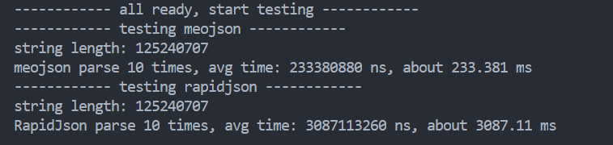

# meojson

[English](#CPP_JSON_Parser_Generator)

## C++ JSON解析/生成库

### 简介

`meojson`是一个`非常快`的JSON解析/生成库，O(n)级复杂度，解析速度比腾讯RapidJson快12倍以上！



### 测试方法

```bash
cd test/parse/
chmod a+x test.sh
./test.sh
```

### 使用方法

1. 生成动态库并安装

```bash
make release
sudo make install
```

2. 在您的项目，添加`-lmeojson`编译选项中
3. enjoy it!

集成方法请参考`sample/sample.cpp`文件

## CPP_JSON_Parser_Generator

### Introduction

`meojson` is a `very fast` json parser and generator, O(n) Complexity, 1200% faster than Tecent's RapidJson parser.


### Testing method

```bash
cd test/parse/
chmod a+x test.sh
./test.sh
```

### Usage

1. make dynamic library and install

```bash
make release
sudo make install
```

2. Add `-lmeojson` compilation option to your project
3. enjoy it!

Please refer to the `sample/sample.cpp` file for integration method